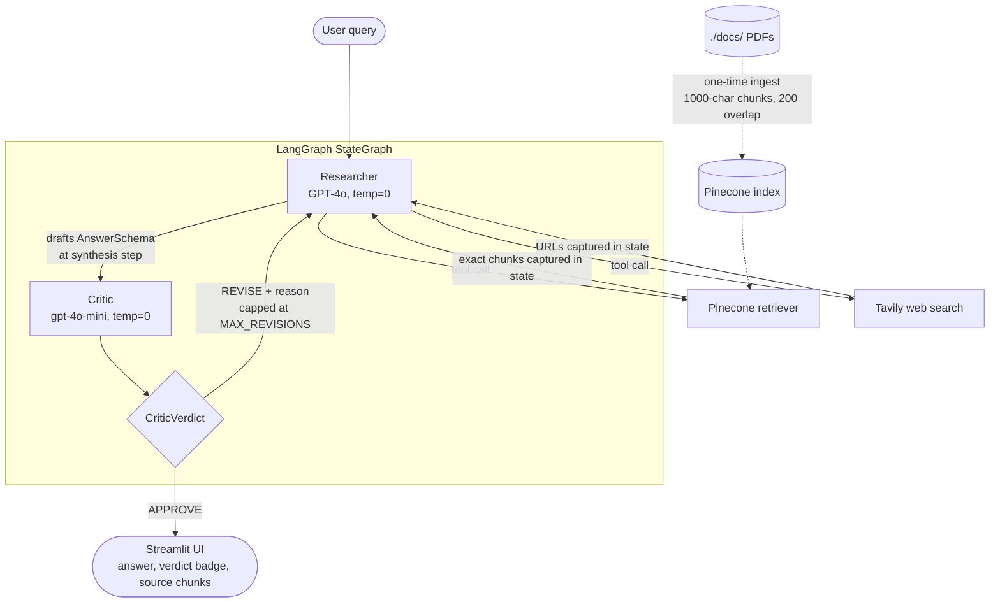

# SentryQuery AI

[](https://github.com/henry-hai/SentryQuery-AI/actions/workflows/ci.yml)

An agentic RAG assistant that answers questions over indexed enterprise documents
with a two-agent LangGraph pipeline over Pinecone, and a Streamlit web UI. A
**Researcher** retrieves and drafts, and a **Critic** verifies every claim
against the retrieved sources.

## Demo

**RAG retrieval + runtime verification.** The Researcher retrieves from Pinecone
and grounds its answer, then the Critic verifies every claim against the exact
retrieved chunks, and the UI shows a confidence score and a green "verified" badge.


It surfaces the exact source chunks it consulted, expanded by PDF and page.


**The Critic catches an unsupported claim.** When an answer overreaches beyond
what the documents support, the Critic flags it and sends it back to the
Researcher for revision. The amber badge shows the answer was revised and names
what was still unsupported.


**Live web search.** For current information not in the filings, the agent
reaches for Tavily instead, and the UI is explicit that web answers are not
verified against the indexed documents.


**Guard rail.** Off-topic questions are refused per the system prompt, without a
wasted tool call.


## Architecture



Dotted edges are the one-time ingestion path. Solid edges are the per-query path.

Documents are indexed once into Pinecone using OpenAI embeddings. On each query,
a **Researcher** agent (built via `create_agent` from `langchain.agents`,
LangChain's current agent constructor, which compiles a LangGraph state graph
internally) reasons about whether and how to call the retriever tool, rather
than following a fixed retrieve-then-answer pipeline. The agent can call the
retriever multiple times with refined queries if needed, and a system prompt
restricts it to grounded, on-topic answers. Its final answer is packaged into a
Pydantic `AnswerSchema` (answer, sources, tool_used, confidence) at a dedicated
synthesis step. The structured output is applied only there, never to the agent
itself, so its tool-calling loop stays intact.

### Multi-agent verification (Researcher + Critic)

The Researcher and a second **Critic** agent are wired as two distinct nodes in
an explicit LangGraph `StateGraph`. After the Researcher drafts an answer, the
Critic checks whether every claim is grounded in the **exact chunks the
Researcher retrieved**, captured in graph state and never re-queried (re-fetching
fresh text would quietly defeat the check). The Critic returns `APPROVE`, or
`REVISE` with a specific reason, and on `REVISE` the graph loops back to the
Researcher with that note, capped at a configurable number of passes
(`MAX_REVISIONS`, default 1).

This is the same groundedness check the eval harness grades offline, now
enforced at runtime: **the Critic enforces at request time what the eval harness
verifies offline.** The Critic runs on a cheaper model (`gpt-4o-mini`) than the
Researcher's GPT-4o, since groundedness checking is a narrower verification task,
so the smaller model suffices at a fraction of the per-call cost. It runs at
`temperature=0` for deterministic, reproducible verdicts.

The Streamlit UI surfaces the final answer, the Critic's verdict (a green
"verified" badge, or amber when the answer was revised), the model's confidence,
and the exact source chunks the agent consulted, expanded by PDF and page.

## Stack

- LangChain agents (`create_agent` from `langchain.agents`) for the Researcher, compiled onto LangGraph
- LangGraph `StateGraph` for the Researcher + Critic multi-agent graph
- Pydantic for the structured `AnswerSchema` / `CriticVerdict` contracts
- LangChain for retriever tooling
- Pinecone as the vector database
- OpenAI `text-embedding-3-small` for embeddings (1536-d)
- GPT-4o for the Researcher, and `gpt-4o-mini` for the cheaper Critic
- Tavily for live web search (optional second agent tool)
- LangSmith for optional run tracing (env-toggleable, with a structured-logging fallback)
- Streamlit for the web UI
- The official MCP Python SDK (`mcp`) for the Model Context Protocol server
- Docker and Docker Compose for the containerized run modes
- GitHub Actions for CI (ruff plus an offline pytest suite), with dev dependencies pinned separately in `requirements-dev.txt`

## Setup

```
python -m venv venv
source venv/bin/activate    # or: venv\Scripts\activate on Windows
python -m pip install -r requirements.txt
```

`python -m pip` rather than a bare `pip` is deliberate. It always installs into
the interpreter you just activated, whereas a `pip` script left behind by a
venv that was copied or moved (a synced folder will do this) can still point at
the interpreter it was originally built for, and silently install somewhere
else. Confirm the environment is wired up before going further:

```
python -c "import mcp, mcp_server"
```

That is silent on success. An `ImportError` means the venv you activated is not
the one the install landed in, so recreate it with the commands above.

Copy `.env.example` to `.env` and fill in your keys:

```
OPENAI_API_KEY=your_key
PINECONE_API_KEY=your_key
TAVILY_API_KEY=your_key
```

LangSmith keys are optional. Add them to trace runs (see [Observability](#observability)).

Pre-create a Pinecone index named `sentry-index` with dimension `1536` and
cosine similarity.

## Usage

Drop your PDFs into `./docs/` and index them once:

```
python sentry_query.py --ingest
```

The corpus currently indexed for the demo is three public 10-K annual filings
spanning retail, airline, and industrial sectors, and the application is
corpus-neutral with no company or document name hard-coded anywhere.

Launch the web UI:

```
python -m streamlit run sentry_query.py
```

## MCP server

The same answering pipeline is also exposed over the [Model Context
Protocol](https://modelcontextprotocol.io), so any MCP client (Claude Desktop,
Claude Code, or your own) can query the indexed corpus through a standard tool
interface. `mcp_server.py` is an interface layer only: it calls the existing
`run_pipeline`, and no agent logic lives in it.

Run it over stdio:

```
python mcp_server.py
```

### The tool

One tool is exposed, `ask_corpus(question: str)`. It returns the full structured
result rather than bare text, so a client sees the groundedness ruling too:

| Field | Meaning |
| --- | --- |
| `answer` | The answer text |
| `sources` | Citations: `filename p.N` for document chunks, or URLs for web results |
| `tool_used` | `docs`, `web`, or `none` |
| `confidence` | The model's self-assessed 0-1 confidence |
| `verdict` | The Critic's groundedness ruling, `APPROVE` or `REVISE` |
| `critic_reason` | Why, naming the unsupported claim on `REVISE` |
| `revisions` | How many revision passes the answer took |
| `cached` | Whether this response came from the cache instead of a paid run |

### Connecting a client

Register the server with any MCP client that launches a local stdio server. For
Claude Desktop, add this to `claude_desktop_config.json` (use absolute paths,
and your own checkout and interpreter):

```json
{
  "mcpServers": {
    "sentryquery": {
      "command": "/path/to/SentryQuery-AI/venv/bin/python",
      "args": ["/path/to/SentryQuery-AI/mcp_server.py"]
    }
  }
}
```

You supply your own OpenAI and Pinecone keys in `.env`, exactly as the UI does.
The server reads them through the same `config.py` loader and never stores or
logs a key. There is no hosted instance: this runs locally, against your own
index.

### Cost controls

Every uncached query costs a paid OpenAI embedding plus a Pinecone query, and an
MCP server is meant to be left running, so two ceilings are built in.

**Answer cache.** Responses are cached in-process, keyed on the normalized
question (trimmed, lowercased, whitespace collapsed), so `"  What Were TOTAL
sales? "` and `"what were total sales?"` are one entry rather than two paid
runs. A repeat question is served from the cache without re-embedding or
re-querying Pinecone. It holds **128 entries** by default and evicts the oldest
by insertion at the cap. Override with `SENTRYQUERY_MCP_CACHE_SIZE`.

**Rate limit.** Each client may make **10 `ask_corpus` calls per rolling
minute** by default. Over-limit calls are rejected with an error naming the
limit and the retry delay, before any paid call is made. Cache hits are free and
do not count against the budget. Override with `SENTRYQUERY_MCP_RATE_LIMIT`.

Both are in-process only. They reset when the server restarts and are not shared
between processes, which is the right scope for a local single-user server and
is not a distributed cache or quota system.

## Running with Docker

The image covers all three run modes and is built from `requirements.txt` only,
runs as a non-root user, and has a healthcheck against Streamlit's health
endpoint. No key is baked into any layer: `.env` is excluded by `.dockerignore`,
and Compose injects your keys at run time with `env_file`. `./docs` is
bind-mounted read-only rather than copied in, so PDFs can be swapped and
re-ingested without a rebuild.

Copy `.env.example` to `.env` and fill in your own OpenAI, Pinecone, and Tavily
keys first, then:

```
# Streamlit UI, on http://localhost:8501
docker compose up ui

# Re-index whatever PDFs are currently in ./docs/
docker compose run --rm ingest

# MCP server, speaking MCP on stdin/stdout
docker compose run --rm -T mcp
```

To register the containerized MCP server with a client, give the client the
`docker run` form instead, since the client owns the pipe:

```
docker run -i --rm --env-file .env -v "$PWD/docs:/app/docs:ro" \
  sentryquery:latest python mcp_server.py
```

Nothing here is deployed or hosted anywhere. These are local run modes.

## Evaluation

A small eval harness lives in `evals/`. It runs each case in `evals/qa.json`
through the full Researcher → Critic graph and checks: (1) the answer contains an
expected keyword, (2) the agent used or skipped the retriever as expected, (3) the
packaged output validates against `AnswerSchema`, and (4) the Critic's verdict
matches on grounded cases. It then runs two **direct Critic checks**: an
ungrounded answer must be flagged `REVISE`, and a grounded one `APPROVE`. That
REVISE check is the case that fails without the Critic and passes with it, the
same groundedness check the Critic enforces at runtime.

```
python evals/eval.py
```

The harness grew alongside the system. The single-agent baseline passed **7/7**
on keyword + tool-use checks, and the current harness passes **9/9** after adding
schema-validation, Critic-verdict, and the two direct Critic checks. The extra
points are new *correctness dimensions* (structured validity, groundedness) that
the original code could not satisfy, not a change in answer accuracy. The
harness output is the only performance number claimed here.

## Continuous integration

GitHub Actions runs on every push and pull request to `main`: Python 3.11, ruff
against a pinned minimal rule set, then an offline pytest suite. The job needs no
API keys and no secrets, runs with `permissions: contents: read`, and finishes in
well under two minutes.

The test suite is deliberately offline. It covers the Pydantic schema contracts,
the source-citation helpers, the eval grading logic, the Critic's evidence
wiring (meaning that `critique()` is handed the exact retrieved chunks alongside
the answer and returns the structured verdict faithfully), and the MCP interface
layer with `run_pipeline` stubbed: the cache serving a repeat question without a
second paid run, the rate limiter rejecting an over-limit call before any paid
call, and the `ask_corpus` response carrying the `AnswerSchema` fields plus the
Critic verdict.

What CI does not do is run the Critic's groundedness judgment, the live model, or
the full `evals/eval.py` harness. That judgment is a live `gpt-4o-mini` call, so
it needs real keys and stays in the local eval run. CI verifies the MCP wiring,
the cache, and the rate limiter deterministically, and the wiring around the
Critic, but not the model's verdict itself.

Docker is deliberately not part of the workflow. A cold `docker build` on a fresh
runner has no layer cache and would reinstall the full runtime stack, pushing the
job past its sub-two-minute budget for no signal the offline tests do not already
give.

## Observability

Every pipeline run emits a structured log record (tool routing, Critic verdict,
revision count, confidence), so there is always basic observability with no
setup.

For full tracing of the two-agent graph, set LangSmith keys in `.env` (see
`.env.example`):

```
LANGSMITH_TRACING=true
LANGSMITH_API_KEY=your_langsmith_key
LANGSMITH_PROJECT=sentryquery
```

With these set, each run traces the Researcher's tool calls, the drafted schema,
the Critic's verdict, and any revision loop as nested runs in LangSmith. If they
are unset, the app runs identically with tracing off and never hard-fails on a
missing tracing key. The Streamlit sidebar shows the current tracing state.

