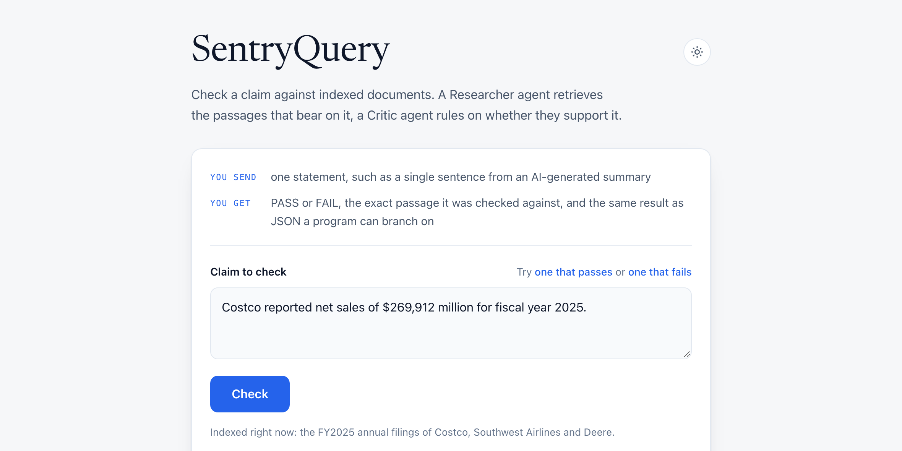
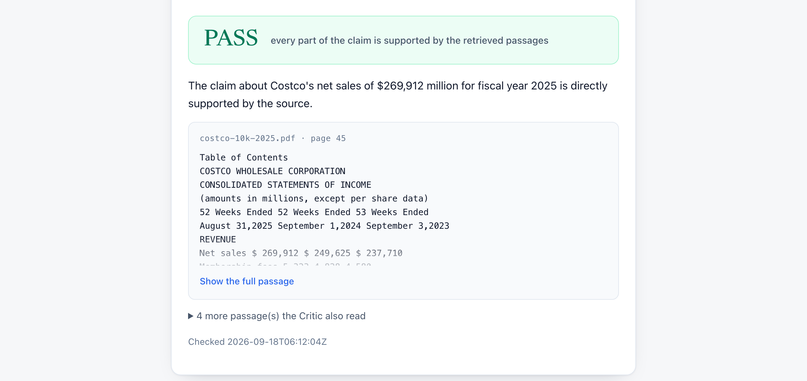
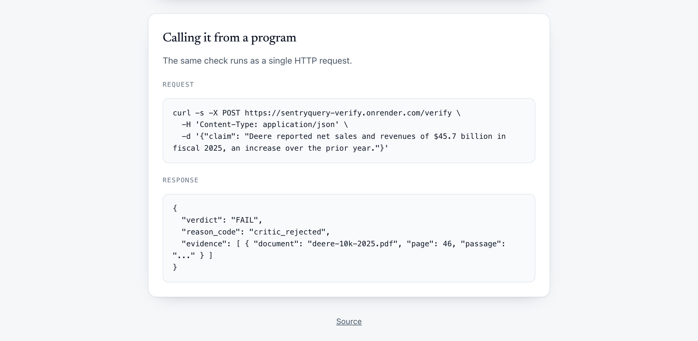
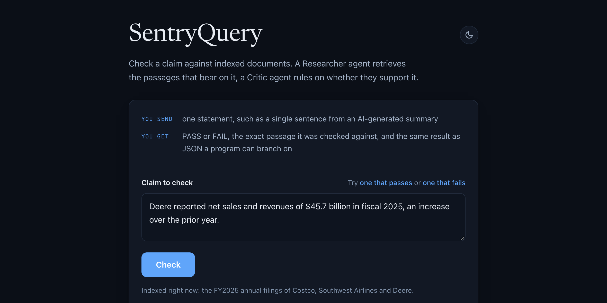
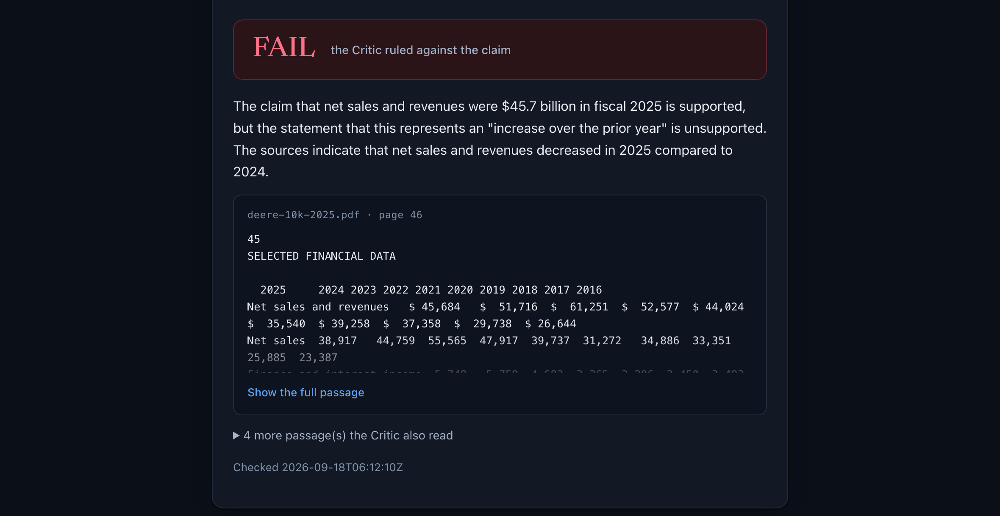

# SentryQuery AI

[](https://github.com/henry-hai/SentryQuery-AI/actions/workflows/ci.yml)

A hallucination guardrail for AI output about indexed documents. POST a claim,
get back PASS or FAIL with the exact passage the verdict was made against, as
JSON a program can branch on. A **Researcher** agent retrieves the passages that
bear on the claim. A **Critic** agent rules on whether they support it.

**Live: https://sentryquery-verify.onrender.com**

Every example claim below was written by hand to test the system. A FAIL means
the claim was rejected, never that a document is wrong.

## Check a claim

Send one statement. Get back a verdict and the passage it was judged against.

```
curl -s -X POST https://sentryquery-verify.onrender.com/verify \
  -H 'Content-Type: application/json' \
  -d '{"claim": "Deere reported net sales and revenues of $45.7 billion in fiscal 2025, an increase over the prior year."}'
```

```json
{
  "verdict": "FAIL",
  "reason_code": "critic_rejected",
  "reason": "The claim that net sales and revenues were $45.7 billion in fiscal 2025 is supported, but the statement that this represents an 'increase over the prior year' is unsupported.",
  "evidence": [
    {
      "document": "deere-10k-2025.pdf",
      "page": 46,
      "passage": "SELECTED FINANCIAL DATA\n  2025     2024 2023\nNet sales and revenues   $ 45,684   $ 51,716  $ 61,251"
    }
  ],
  "cached": false,
  "checked_at": "2026-09-17T04:59:24Z"
}
```

### The response

| Field | Meaning |
| --- | --- |
| `verdict` | PASS or FAIL. The only field a caller branches on |
| `reason_code` | `null` on PASS. `critic_rejected` when passages came back and the Critic ruled against the claim, `no_evidence` when nothing relevant was retrieved. Both read off graph state, not model judgment |
| `reason` | The Critic's own words, unchanged |
| `evidence` | The exact chunks the Critic ruled against, closest first, with document and page. Never re-queried |
| `cached` | Served from the in-process cache. `checked_at` keeps the original run time |

`no_evidence` is a FAIL, not a third verdict. For a guardrail, "could not be
checked" must not read as approved.

Errors: `400 invalid_claim` for blank or over 1000 characters, `429
rate_limited` with `Retry-After`, `502 upstream_failure`. The cache and rate
limit are checked first, so a repeat or over-limit claim costs nothing.

## Browser View

The service also serves a page at `/` that calls the endpoint above.



The verdict comes back with the Critic's reason and the passage it read. Long
passages are cut off and open on click.



The page also shows the call behind it.



It has a dark mode and keeps your choice.





## A claim it caught

A false claim written to test the Critic, run against the live service.

> **Claim.** Deere reported net sales and revenues of $45.7 billion in fiscal
> 2025, an increase over the prior year.
>
> **FAIL**, `critic_rejected`, against `deere-10k-2025.pdf` p.46:
>
> ```
>                            2025       2024      2023      2022
> Net sales and revenues   $ 45,684   $ 51,716  $ 61,251  $ 52,577
> ```

The figure is right. $45,684 million rounds to $45.7 billion. Only the direction
is wrong, and the prior year sits in the same row of the same table the Critic
was handed. That is the shape a real hallucination takes: the number right, the
trend backwards.

Verdicts reproduce across runs. The wording of `reason` does not, so treat
`verdict` and `reason_code` as the contract and `reason` as explanation.

## Running it

```
pip install -r requirements-api.txt
uvicorn api:app --reload
```

`GET /healthz` is a liveness check and makes no paid call.

### Deploying

`render.yaml` describes one free Render web service: build
`requirements-api.txt`, start uvicorn, health check `/healthz`. The three keys
are `sync: false`, so Render prompts for them and they never enter the repo.
`.python-version` pins 3.11, since Render now defaults to 3.14.

A free instance spins down after 15 minutes idle. Measured cold start: 40
seconds. Wake it before a demo:

```
curl -s https://sentryquery-verify.onrender.com/healthz
```

Only the API is deployed. Ingestion, the Streamlit UI and the MCP server stay
local, which is why the service installs `requirements-api.txt` and not
`requirements.txt`.

## Architecture


Both entry points share one graph and one function:

```python
critique(critic_llm, answer_or_claim, chunks) -> CriticVerdict
```

A question runs the full loop and the Critic judges the Researcher's draft. A
claim uses the Researcher only to gather passages, then the Critic judges the
claim itself against those same chunks. Neither path re-queries the index to
build its evidence, because re-fetching fresh text would defeat the check.

Retrieval is a tool the Researcher decides to call, not a fixed step. It can
call it more than once with refined queries. Its answer is packaged into a
Pydantic `AnswerSchema` at a separate synthesis step, never around the agent
itself, so the tool-calling loop stays intact.

The Critic returns APPROVE or REVISE with a reason. On REVISE the graph loops
back to the Researcher, capped at `MAX_REVISIONS` (default 1). It runs on
`gpt-4o-mini` rather than GPT-4o because groundedness checking is narrower than
answering, at `temperature=0` for reproducible verdicts.

## Stack

- LangChain agents (`create_agent`) for the Researcher, compiled onto LangGraph
- LangGraph `StateGraph` for the Researcher + Critic graph
- Pydantic for the `AnswerSchema` / `CriticVerdict` contracts
- Pinecone for vector search, OpenAI `text-embedding-3-small` for embeddings
- GPT-4o for the Researcher, `gpt-4o-mini` for the Critic
- Tavily for live web search
- FastAPI and uvicorn for `/verify`, hosted on Render
- Streamlit for the local UI
- The official MCP Python SDK for the Model Context Protocol server
- Docker and Docker Compose for the local run modes
- LangSmith for optional tracing
- GitHub Actions for CI, ruff and pytest

## Setup

```
python -m venv venv
source venv/bin/activate    # venv\Scripts\activate on Windows
python -m pip install -r requirements.txt
```

`python -m pip` over bare `pip`: a pip script left behind by a venv that was
copied or moved can still point at the interpreter it was built for.

Dependencies split three ways. `requirements-base.txt` holds the pipeline and
every pin. `requirements.txt` adds Streamlit and the MCP SDK.
`requirements-api.txt` adds FastAPI and uvicorn. `requirements-dev.txt` pulls in
both plus ruff and pytest.

Copy `.env.example` to `.env` and fill in `OPENAI_API_KEY`, `PINECONE_API_KEY`
and `TAVILY_API_KEY`. Pre-create a Pinecone index named `sentry-index`,
dimension `1536`, cosine.

## Usage

Drop PDFs into `./docs/` and index them once:

```
python sentry_query.py --ingest
```

No company or document name is hard-coded anywhere, so the same code runs over
whatever is indexed. The demo corpus is three public 10-K filings across retail,
airline and industrial.

Launch the chat UI:

```
python -m streamlit run sentry_query.py
```


The exact source chunks, by PDF and page.


When an answer overreaches, the Critic flags it and sends it back for revision.


For current information the agent reaches for Tavily instead, and the UI says
web answers are not verified against the documents.


Off-topic questions are refused without a wasted tool call.


## MCP server

The same pipeline over the [Model Context
Protocol](https://modelcontextprotocol.io), so any MCP client can query the
corpus through a standard tool. `mcp_server.py` is an interface layer: it calls
`run_pipeline` and holds no agent logic.

```
python mcp_server.py
```

One tool, `ask_corpus(question)`, returning `answer`, `sources`, `tool_used`,
`confidence`, `verdict`, `critic_reason`, `revisions` and `cached`. A client
sees the groundedness ruling, not just text.

For Claude Desktop, in `claude_desktop_config.json`:

```json
{
  "mcpServers": {
    "sentryquery": {
      "command": "/path/to/SentryQuery-AI/venv/bin/python",
      "args": ["/path/to/SentryQuery-AI/mcp_server.py"]
    }
  }
}
```

Absolute paths matter, the working directory does not. The client starts the
server from wherever it happens to be (Claude Desktop uses `/`), so
`mcp_server.py` resolves `.env` from its own location. Keys stay in `.env` and
never go in the client config. Nothing is hosted, this runs against your index.

### Cost controls

Every uncached query costs a paid embedding and a Pinecone query, and both the
MCP server and the API are meant to be left running. `costcontrols.py` holds
two ceilings that both use, checked before any paid call.

**Cache.** Keyed on the normalized question or claim, trimmed, lowercased,
whitespace collapsed. 128 entries, oldest evicted at the cap.

**Rate limit.** 10 calls per rolling minute per client. Cache hits are free and
do not count.

Override with `SENTRYQUERY_MCP_*` or `SENTRYQUERY_API_*`. Both are in-process
only. They reset on restart and are not shared between processes.

## Docker

One image, all three local modes, non-root, healthchecked. No key in any layer:
`.dockerignore` excludes `.env` and Compose injects keys at run time. `./docs`
is bind-mounted read-only so PDFs swap without a rebuild.

```
docker compose up ui                  # http://localhost:8501
docker compose run --rm ingest        # re-index ./docs/
docker compose run --rm -T mcp        # MCP over stdin/stdout
```

To give an MCP client the containerized server, hand it the `docker run` form,
since the client owns the pipe:

```
docker run -i --rm --env-file .env -v "$PWD/docs:/app/docs:ro" \
  sentryquery:latest python mcp_server.py
```

None of these is deployed. The image builds from `requirements.txt`, so it does
not carry FastAPI. The deployed `/verify` service is separate.

## Evaluation

```
python evals/eval.py
```

Runs each case in `evals/qa.json` through the full graph and checks the answer
keyword, retriever routing, `AnswerSchema` validity and the Critic's verdict.
Then two direct Critic checks: an ungrounded answer must be REVISE, a grounded
one APPROVE. The REVISE check is the one that fails without the Critic.

The single-agent baseline passed 7/7 on keyword and tool-use checks. The current
harness passes 9/9 after adding schema validation, verdict matching and the two
direct checks. Those are new correctness dimensions, not a change in answer
accuracy. This is the only performance number claimed here.

## Continuous integration

GitHub Actions on every push and PR to `main`: Python 3.11, ruff, then an
offline pytest suite. No keys, no secrets, `permissions: contents: read`, under
two minutes.

The suite covers the schema contracts, the citation helpers, the eval grading,
the Critic's evidence wiring, the MCP layer and the `/verify` layer, both with
the pipeline stubbed. 55 tests.

It does not run the Critic's groundedness judgment. That is a live
`gpt-4o-mini` call, so it needs real keys and stays in `evals/eval.py`. CI
verifies the wiring, the cache and the rate limiter, not the model's verdict.
The recorded catch above came from a real run, not from CI.

Docker is not in the workflow. A cold build on a fresh runner has no layer cache
and would blow the time budget for no signal the offline tests do not give.

## Observability

Every run emits a structured log record: tool routing, verdict, revision count,
confidence. For full tracing of the graph, set LangSmith keys in `.env`:

```
LANGSMITH_TRACING=true
LANGSMITH_API_KEY=your_langsmith_key
LANGSMITH_PROJECT=sentryquery
```

Unset, the app runs identically with tracing off. The Streamlit sidebar shows
the current state.


