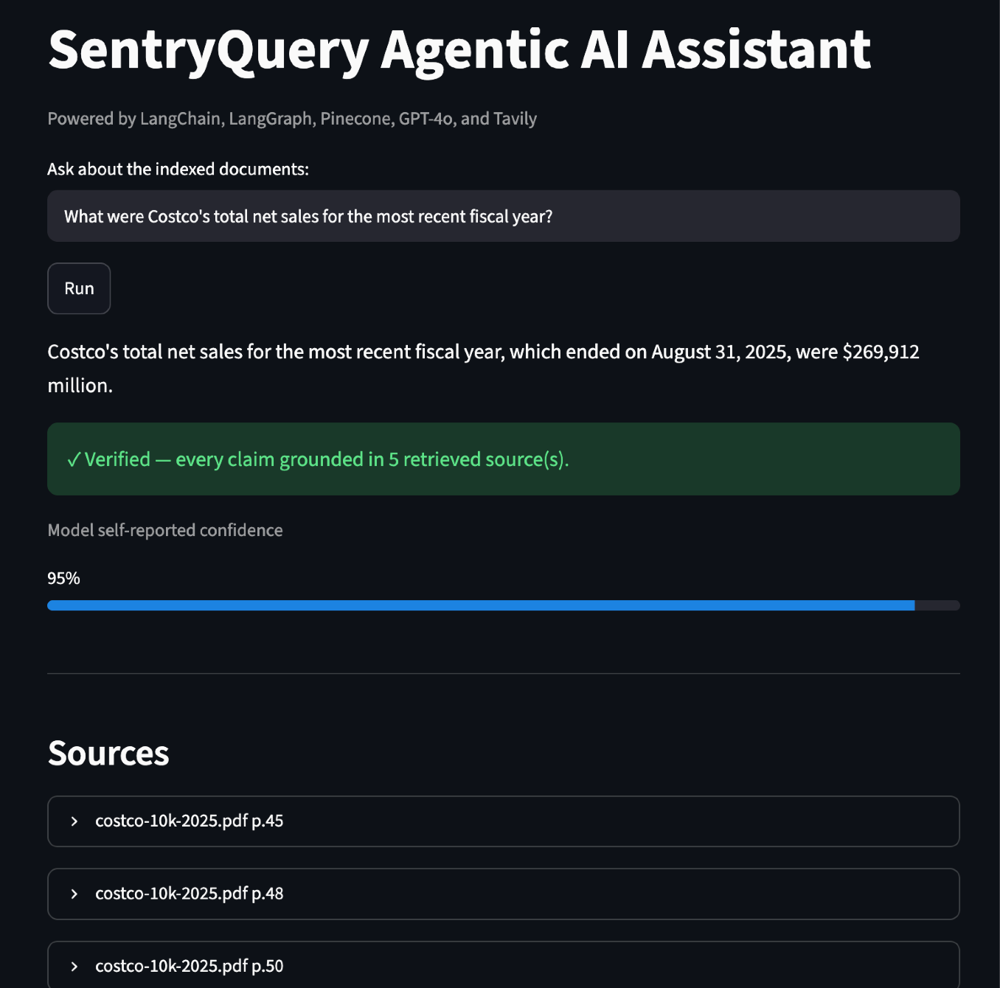
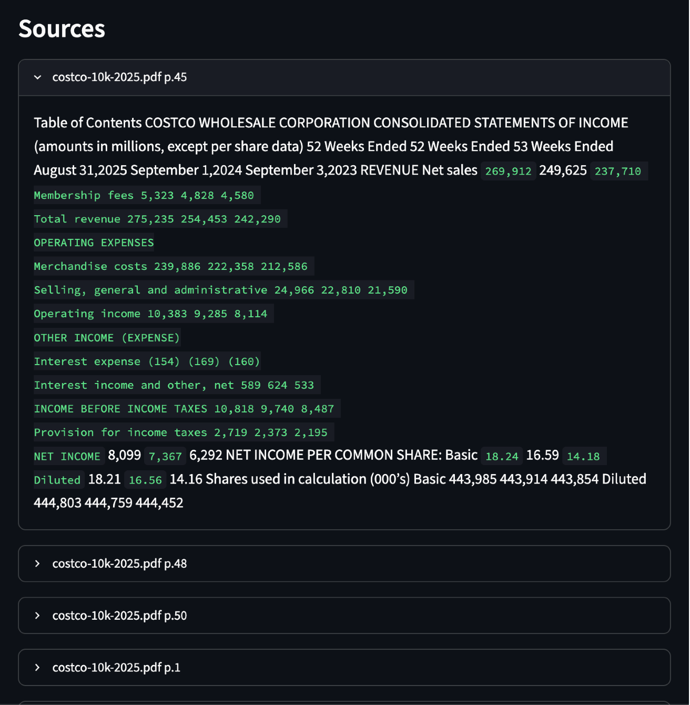
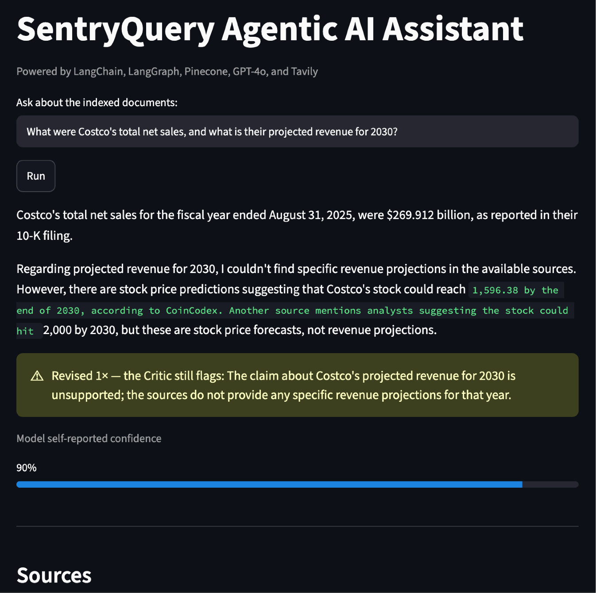
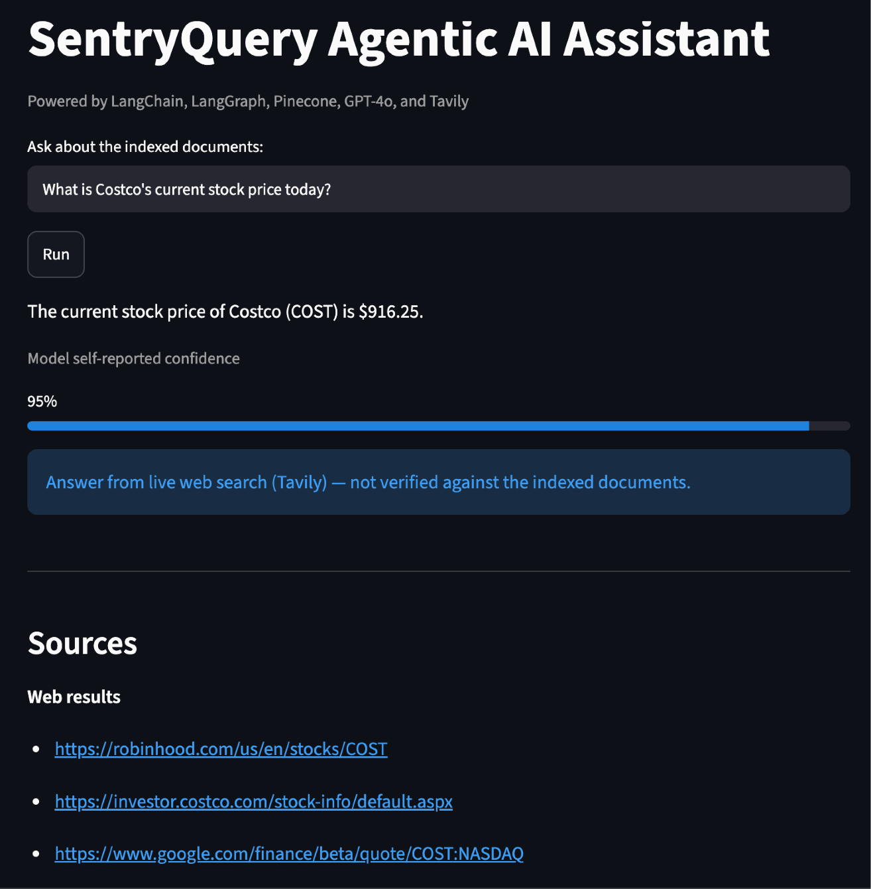
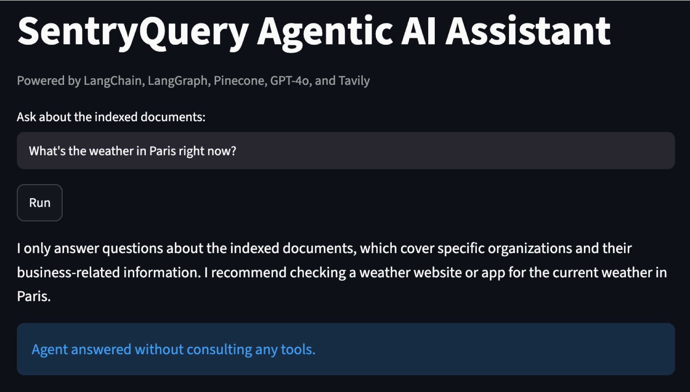
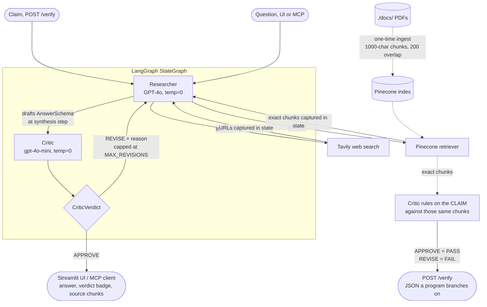
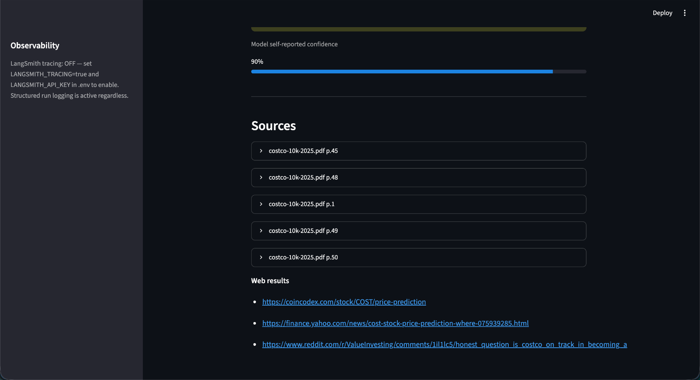

# SentryQuery AI

[](https://github.com/henry-hai/SentryQuery-AI/actions/workflows/ci.yml)

A hallucination guardrail for AI output about a set of indexed documents. You
POST a claim and get back PASS or FAIL with the exact passages the verdict was
made against, as JSON a program can branch on. Two agents do the work: a
**Researcher** retrieves the passages that bear on the claim, and a **Critic**
rules on whether they support it.

**Live: https://sentryquery-verify.onrender.com**

## Check a claim

```
curl -s -X POST https://sentryquery-verify.onrender.com/verify \
  -H 'Content-Type: application/json' \
  -d '{"claim": "Deere reported net sales and revenues of $45.7 billion in fiscal 2025, an increase over the prior year."}'
```

```json
{
  "claim": "Deere reported net sales and revenues of $45.7 billion in fiscal 2025, an increase over the prior year.",
  "verdict": "FAIL",
  "reason_code": "critic_rejected",
  "reason": "The claim that net sales and revenues were $45.7 billion in fiscal 2025 is supported, but the statement that this represents an 'increase over the prior year' is unsupported. The sources indicate that net sales and revenues decreased in 2025 compared to 2024.",
  "evidence": [
    {
      "document": "deere-10k-2025.pdf",
      "page": 46,
      "passage": "SELECTED FINANCIAL DATA\n  2025     2024 2023 ...\nNet sales and revenues   $ 45,684   $  51,716  $  61,251 ..."
    }
  ],
  "cached": false,
  "checked_at": "2026-09-17T04:59:24Z"
}
```

The same service serves a one-page demo at `/` with a claim box and the verdict.

### A claim it caught

That example is the real one, copied from an actual run and reproduced below.

> **Claim.** Deere reported net sales and revenues of $45.7 billion in fiscal
> 2025, an increase over the prior year.
>
> **Verdict.** FAIL, `critic_rejected`.
>
> **Why.** The claim that net sales and revenues were $45.7 billion in fiscal
> 2025 is supported, but the statement that this represents an "increase over
> the prior year" is unsupported. The sources indicate that net sales and
> revenues decreased in 2025 compared to 2024.
>
> **The passage it was checked against**, `deere-10k-2025.pdf` p.46:
>
> ```
> SELECTED FINANCIAL DATA
>                            2025       2024      2023      2022
> Net sales and revenues   $ 45,684   $ 51,716  $ 61,251  $ 52,577
> Net sales                  38,917     44,759    55,565    47,917
> ```

The figure in the claim is correct. $45,684 million does round to $45.7 billion.
Only the direction is wrong, and the prior year sits in the same row of the same
table the Critic was handed. This is the shape a real hallucination takes: a
summary that gets the number right and the trend backwards. The verdict is what
stops it reaching a reader.

The verdict reproduces across runs. The exact wording of `reason` does not,
because it is generated text, so treat the words as an explanation and the
`verdict` and `reason_code` fields as the contract.

### The response fields

| Field | Meaning |
| --- | --- |
| `verdict` | `PASS` or `FAIL`. The only field a caller needs to branch on |
| `reason_code` | `null` on PASS. On FAIL, `critic_rejected` when passages were retrieved and the Critic ruled against the claim, or `no_evidence` when nothing relevant was retrieved at all. Both are read off graph state, not off a model judgment |
| `reason` | The Critic's own words, passed through unchanged |
| `evidence` | The exact chunks the Critic ruled against, closest match first, each with its document and 1-based page. Not re-queried and not re-ranked |
| `cached` | Whether this came from the in-process cache instead of a paid run. `checked_at` stays the time of the run that produced it |

`no_evidence` is reported as FAIL rather than as a third verdict, because for a
guardrail "could not be checked" must never read as approved. It does not
distinguish a claim the documents contradict from one they are silent on. That
distinction is the Critic's judgment rather than graph state, so it is not
claimed as a field. The `reason` text usually carries it.

Errors are `400 invalid_claim` for a blank claim or one over 1000 characters,
`429 rate_limited` with a `Retry-After` header, and `502 upstream_failure`. The
cache and the rate limit are checked before any paid call, so neither a repeat
claim nor an over-limit one costs an OpenAI or Pinecone request.

## Running the API

```
pip install -r requirements-api.txt
uvicorn api:app --reload
```

Then open http://127.0.0.1:8000. `GET /healthz` is a liveness check that makes
no paid call.

### Deploying it

`render.yaml` describes a single free Render web service: build
`requirements-api.txt`, start `uvicorn api:app --host 0.0.0.0 --port $PORT`,
health check `/healthz`. The three API keys are declared `sync: false`, so
Render prompts for them at Blueprint creation and they are never committed.
`.python-version` pins 3.11, which matters because Render now defaults to 3.14.

A free instance spins down after 15 minutes idle. A measured cold start on this
service took 40 seconds. `GET /healthz` makes no paid call, so it is the cheap
way to wake it before a demo:

```
curl -s https://sentryquery-verify.onrender.com/healthz
```

Only the API is deployed. Ingestion, the Streamlit UI and the MCP server stay
local, which is why the service installs `requirements-api.txt` rather than
`requirements.txt`.

## The Streamlit app

The original chat UI still works and is still the easiest way to explore the
corpus by asking questions rather than checking claims.

### Screenshots

**RAG retrieval + runtime verification.** The Researcher retrieves from Pinecone
and grounds its answer, then the Critic verifies every claim against the exact
retrieved chunks, and the UI shows a confidence score and a green "verified" badge.



It surfaces the exact source chunks it consulted, expanded by PDF and page.



**The Critic catches an unsupported claim.** When an answer overreaches beyond
what the documents support, the Critic flags it and sends it back to the
Researcher for revision. The amber badge shows the answer was revised and names
what was still unsupported.



**Live web search.** For current information not in the filings, the agent
reaches for Tavily instead, and the UI is explicit that web answers are not
verified against the indexed documents.



**Guard rail.** Off-topic questions are refused per the system prompt, without a
wasted tool call.



## Architecture



The two entry points share one graph. A question runs the full loop and the
Critic rules on the Researcher's draft. A claim uses the Researcher only to
gather passages, and the Critic then rules on the claim itself against those
same chunks. Neither path re-queries the index to build its evidence.

Documents are indexed once into Pinecone using OpenAI embeddings. On each query,
a **Researcher** agent (built via `create_agent` from `langchain.agents`,
LangChain's current agent constructor, which compiles a LangGraph state graph
internally) reasons about whether and how to call the retriever tool, rather
than following a fixed retrieve-then-answer pipeline. The agent can call the
retriever multiple times with refined queries if needed, and a system prompt
restricts it to grounded, on-topic answers. Its final answer is packaged into a
Pydantic `AnswerSchema` (answer, sources, tool_used, confidence) at a dedicated
synthesis step. The structured output is applied only there, never to the agent
itself, so its tool-calling loop stays intact.

### Multi-agent verification (Researcher + Critic)

The Researcher and a second **Critic** agent are wired as two distinct nodes in
an explicit LangGraph `StateGraph`. After the Researcher drafts an answer, the
Critic checks whether every claim is grounded in the **exact chunks the
Researcher retrieved**, captured in graph state and never re-queried (re-fetching
fresh text would quietly defeat the check). The Critic returns `APPROVE`, or
`REVISE` with a specific reason, and on `REVISE` the graph loops back to the
Researcher with that note, capped at a configurable number of passes
(`MAX_REVISIONS`, default 1).

This is the same groundedness check the eval harness grades offline, now
enforced at runtime: **the Critic enforces at request time what the eval harness
verifies offline.** The Critic runs on a cheaper model (`gpt-4o-mini`) than the
Researcher's GPT-4o, since groundedness checking is a narrower verification task,
so the smaller model suffices at a fraction of the per-call cost. It runs at
`temperature=0` for deterministic, reproducible verdicts.

The Streamlit UI surfaces the final answer, the Critic's verdict (a green
"verified" badge, or amber when the answer was revised), the model's confidence,
and the exact source chunks the agent consulted, expanded by PDF and page.

## Stack

- LangChain agents (`create_agent` from `langchain.agents`) for the Researcher, compiled onto LangGraph
- LangGraph `StateGraph` for the Researcher + Critic multi-agent graph
- Pydantic for the structured `AnswerSchema` / `CriticVerdict` contracts
- LangChain for retriever tooling
- Pinecone as the vector database
- OpenAI `text-embedding-3-small` for embeddings (1536-d)
- GPT-4o for the Researcher, and `gpt-4o-mini` for the cheaper Critic
- Tavily for live web search (optional second agent tool)
- LangSmith for optional run tracing (env-toggleable, with a structured-logging fallback)
- FastAPI and uvicorn for the deployed `/verify` service and its one static page
- Render for hosting that service on a single free web instance
- Streamlit for the local web UI
- The official MCP Python SDK (`mcp`) for the Model Context Protocol server
- Docker and Docker Compose for the containerized run modes
- GitHub Actions for CI (ruff plus an offline pytest suite), with dev dependencies pinned separately in `requirements-dev.txt`

## Setup

```
python -m venv venv
source venv/bin/activate    # or: venv\Scripts\activate on Windows
python -m pip install -r requirements.txt
```

Dependencies are split three ways. `requirements-base.txt` holds the pipeline
itself and every pin, and the other two add only what their own transport needs:
`requirements.txt` adds Streamlit and the MCP SDK for the local app, and
`requirements-api.txt` adds FastAPI and uvicorn for the deployed service. One
place to bump a version means the local app and the deployed service cannot
drift apart. `requirements-dev.txt` pulls in both plus ruff and pytest.

`python -m pip` rather than a bare `pip` is deliberate. It always installs into
the interpreter you just activated, whereas a `pip` script left behind by a
venv that was copied or moved (a synced folder will do this) can still point at
the interpreter it was originally built for, and silently install somewhere
else. Confirm the environment is wired up before going further:

```
python -c "import mcp, mcp_server"
```

That is silent on success. An `ImportError` means the venv you activated is not
the one the install landed in, so recreate it with the commands above.

Copy `.env.example` to `.env` and fill in your keys:

```
OPENAI_API_KEY=your_key
PINECONE_API_KEY=your_key
TAVILY_API_KEY=your_key
```

LangSmith keys are optional. Add them to trace runs (see [Observability](#observability)).

Pre-create a Pinecone index named `sentry-index` with dimension `1536` and
cosine similarity.

## Usage

Drop your PDFs into `./docs/` and index them once:

```
python sentry_query.py --ingest
```

The corpus currently indexed for the demo is three public 10-K annual filings
spanning retail, airline, and industrial sectors, and the application is
corpus-neutral with no company or document name hard-coded anywhere.

Launch the web UI:

```
python -m streamlit run sentry_query.py
```

## MCP server

The same answering pipeline is also exposed over the [Model Context
Protocol](https://modelcontextprotocol.io), so any MCP client (Claude Desktop,
Claude Code, or your own) can query the indexed corpus through a standard tool
interface. `mcp_server.py` is an interface layer only: it calls the existing
`run_pipeline`, and no agent logic lives in it.

Run it over stdio:

```
python mcp_server.py
```

### The tool

One tool is exposed, `ask_corpus(question: str)`. It returns the full structured
result rather than bare text, so a client sees the groundedness ruling too:

| Field | Meaning |
| --- | --- |
| `answer` | The answer text |
| `sources` | Citations: `filename p.N` for document chunks, or URLs for web results |
| `tool_used` | `docs`, `web`, or `none` |
| `confidence` | The model's self-assessed 0-1 confidence |
| `verdict` | The Critic's groundedness ruling, `APPROVE` or `REVISE` |
| `critic_reason` | Why, naming the unsupported claim on `REVISE` |
| `revisions` | How many revision passes the answer took |
| `cached` | Whether this response came from the cache instead of a paid run |

### Connecting a client

Register the server with any MCP client that launches a local stdio server. For
Claude Desktop, add this to `claude_desktop_config.json` (use absolute paths,
and your own checkout and interpreter):

```json
{
  "mcpServers": {
    "sentryquery": {
      "command": "/path/to/SentryQuery-AI/venv/bin/python",
      "args": ["/path/to/SentryQuery-AI/mcp_server.py"]
    }
  }
}
```

Absolute paths matter here, but the working directory does not. The client
starts the server itself, from whatever directory the client happens to have
(Claude Desktop uses `/`), so `mcp_server.py` resolves `.env` relative to its
own location rather than the cwd. There is nothing to configure for that, and
no reason to copy keys into the client config.

You supply your own OpenAI and Pinecone keys in `.env`, exactly as the UI does.
The server never stores or logs a key, and a key already set in the environment
takes precedence over the file, so a client that injects one still wins. There
is no hosted instance: this runs locally, against your own index.

### Cost controls

Every uncached query costs a paid OpenAI embedding plus a Pinecone query, and an
MCP server is meant to be left running, so two ceilings are built in.

**Answer cache.** Responses are cached in-process, keyed on the normalized
question (trimmed, lowercased, whitespace collapsed), so `"  What Were TOTAL
sales? "` and `"what were total sales?"` are one entry rather than two paid
runs. A repeat question is served from the cache without re-embedding or
re-querying Pinecone. It holds **128 entries** by default and evicts the oldest
by insertion at the cap. Override with `SENTRYQUERY_MCP_CACHE_SIZE`.

**Rate limit.** Each client may make **10 `ask_corpus` calls per rolling
minute** by default. Over-limit calls are rejected with an error naming the
limit and the retry delay, before any paid call is made. Cache hits are free and
do not count against the budget. Override with `SENTRYQUERY_MCP_RATE_LIMIT`.

Both are in-process only. They reset when the server restarts and are not shared
between processes, which is the right scope for a local single-user server and
is not a distributed cache or quota system.

## Running with Docker

The image covers all three run modes and is built from `requirements.txt` only,
runs as a non-root user, and has a healthcheck against Streamlit's health
endpoint. No key is baked into any layer: `.env` is excluded by `.dockerignore`,
and Compose injects your keys at run time with `env_file`. `./docs` is
bind-mounted read-only rather than copied in, so PDFs can be swapped and
re-ingested without a rebuild.

Copy `.env.example` to `.env` and fill in your own OpenAI, Pinecone, and Tavily
keys first, then:

```
# Streamlit UI, on http://localhost:8501
docker compose up ui

# Re-index whatever PDFs are currently in ./docs/
docker compose run --rm ingest

# MCP server, speaking MCP on stdin/stdout
docker compose run --rm -T mcp
```

To register the containerized MCP server with a client, give the client the
`docker run` form instead, since the client owns the pipe:

```
docker run -i --rm --env-file .env -v "$PWD/docs:/app/docs:ro" \
  sentryquery:latest python mcp_server.py
```

These three are local run modes and none of them is deployed. The image is
built from `requirements.txt`, which is why it does not carry FastAPI: the
deployed `/verify` service is a separate Render web service built from
`requirements-api.txt` (see [Deploying it](#deploying-it)).

## Evaluation

A small eval harness lives in `evals/`. It runs each case in `evals/qa.json`
through the full Researcher → Critic graph and checks: (1) the answer contains an
expected keyword, (2) the agent used or skipped the retriever as expected, (3) the
packaged output validates against `AnswerSchema`, and (4) the Critic's verdict
matches on grounded cases. It then runs two **direct Critic checks**: an
ungrounded answer must be flagged `REVISE`, and a grounded one `APPROVE`. That
REVISE check is the case that fails without the Critic and passes with it, the
same groundedness check the Critic enforces at runtime.

```
python evals/eval.py
```

The harness grew alongside the system. The single-agent baseline passed **7/7**
on keyword + tool-use checks, and the current harness passes **9/9** after adding
schema-validation, Critic-verdict, and the two direct Critic checks. The extra
points are new *correctness dimensions* (structured validity, groundedness) that
the original code could not satisfy, not a change in answer accuracy. The
harness output is the only performance number claimed here.

## Continuous integration

GitHub Actions runs on every push and pull request to `main`: Python 3.11, ruff
against a pinned minimal rule set, then an offline pytest suite. The job needs no
API keys and no secrets, runs with `permissions: contents: read`, and finishes in
well under two minutes.

The test suite is deliberately offline. It covers the Pydantic schema contracts,
the source-citation helpers, the eval grading logic, the Critic's evidence
wiring (meaning that `critique()` is handed the exact retrieved chunks alongside
the answer and returns the structured verdict faithfully), the MCP interface
layer with `run_pipeline` stubbed (the cache serving a repeat question without a
second paid run, the rate limiter rejecting an over-limit call before any paid
call, and the `ask_corpus` response carrying the `AnswerSchema` fields plus the
Critic verdict), and the `/verify` layer with both `run_pipeline` and `critique`
stubbed: that APPROVE maps to PASS and REVISE to FAIL, that the Critic is handed
the claim itself rather than a drafted answer, that `reason_code` comes off
graph state, that the evidence returned is the chunks that were ruled against,
and the HTTP status codes.

What CI does not do is run the Critic's groundedness judgment, the live model, or
the full `evals/eval.py` harness. That judgment is a live `gpt-4o-mini` call, so
it needs real keys and stays in the local eval run. CI verifies the MCP wiring,
the `/verify` wiring, the cache, and the rate limiter deterministically, and the
wiring around the Critic, but not the model's verdict itself. The recorded catch
above came from a real run against real keys, not from CI.

Docker is deliberately not part of the workflow. A cold `docker build` on a fresh
runner has no layer cache and would reinstall the full runtime stack, pushing the
job past its sub-two-minute budget for no signal the offline tests do not already
give.

## Observability

Every pipeline run emits a structured log record (tool routing, Critic verdict,
revision count, confidence), so there is always basic observability with no
setup.

For full tracing of the two-agent graph, set LangSmith keys in `.env` (see
`.env.example`):

```
LANGSMITH_TRACING=true
LANGSMITH_API_KEY=your_langsmith_key
LANGSMITH_PROJECT=sentryquery
```

With these set, each run traces the Researcher's tool calls, the drafted schema,
the Critic's verdict, and any revision loop as nested runs in LangSmith. If they
are unset, the app runs identically with tracing off and never hard-fails on a
missing tracing key. The Streamlit sidebar shows the current tracing state.

